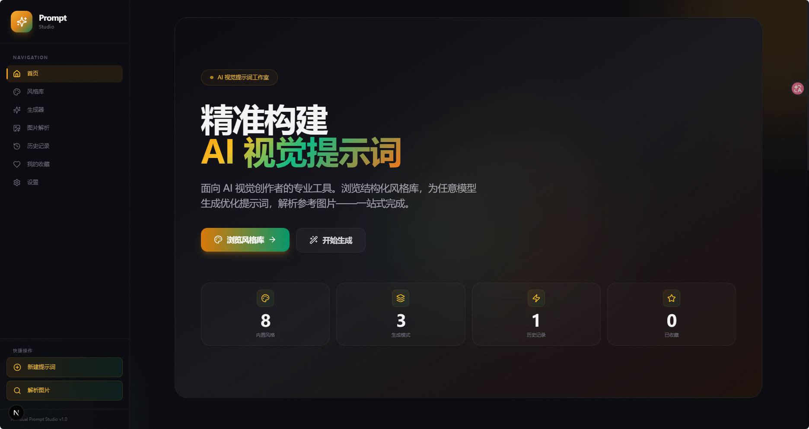
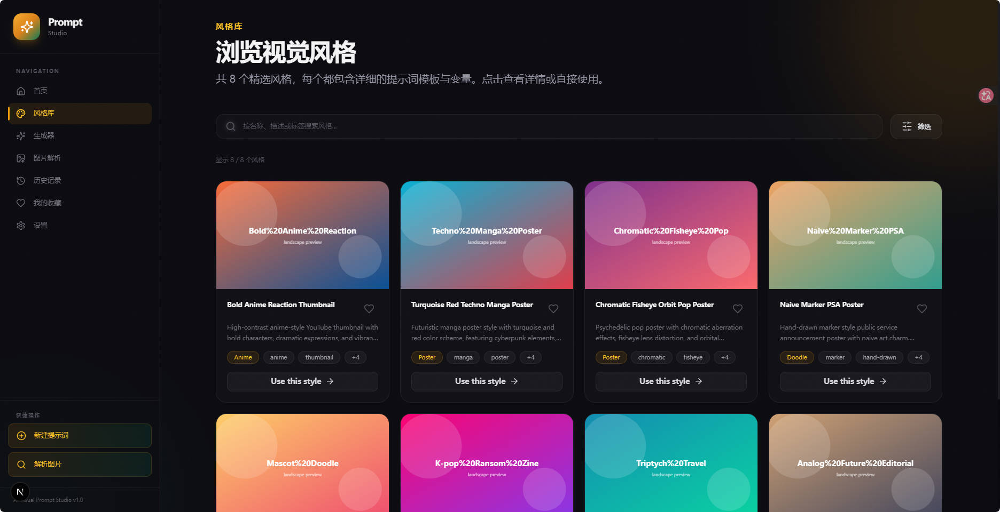
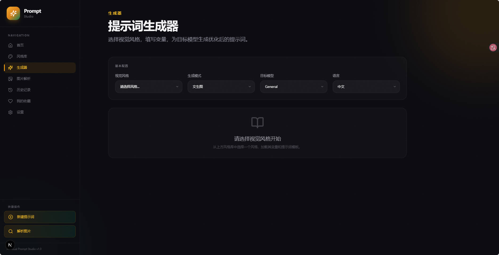
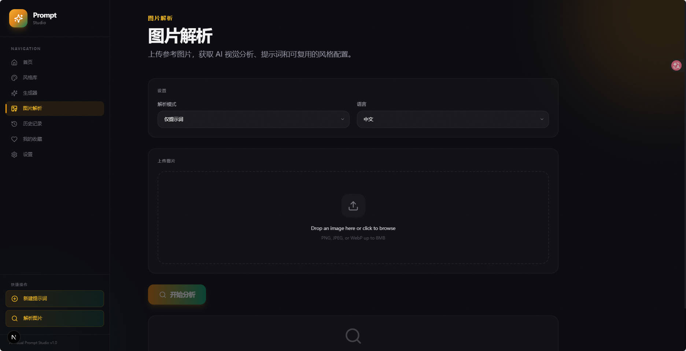
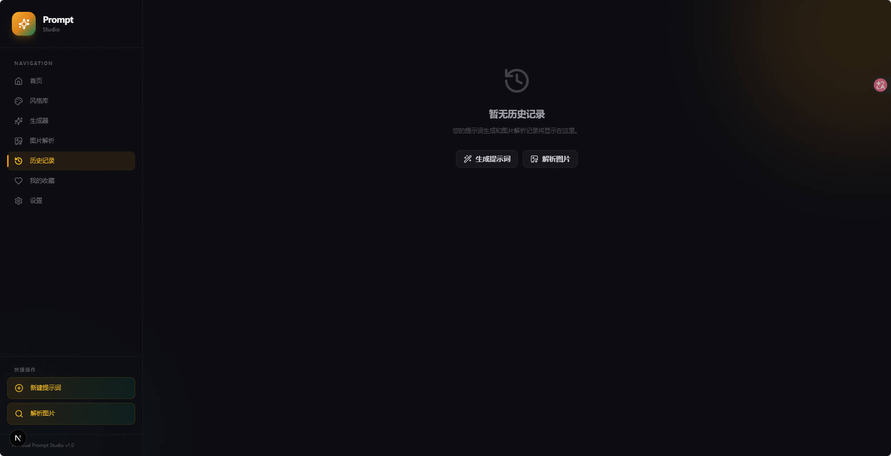
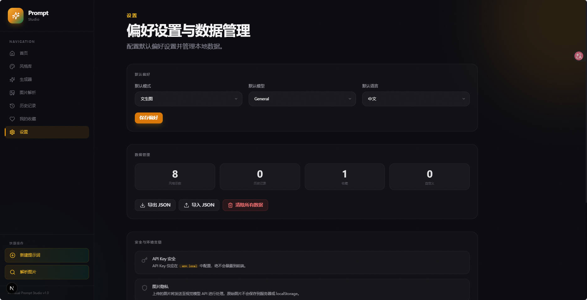

# 从零打造 AI Visual Prompt Studio：一个前端人的 AI 工具探索之路

> 本文详细记录了 AI Visual Prompt Studio 项目的设计思路、技术选型、核心实现与开发心得。这是一个面向 AI 视觉创作者的提示词工程工具，完全运行在浏览器端，无需后端服务。

## 目录

- [项目背景](#项目背景)
- [功能亮点](#功能亮点)
- [技术架构](#技术架构)
- [核心实现](#核心实现)
- [设计系统](#设计系统)
- [开发心得](#开发心得)
- [项目截图](#项目截图)
- [开源地址](#开源地址)

---

## 项目背景

随着 AI 绘画工具（Midjourney、Stable Diffusion、Flux、即梦、可灵等）的普及，越来越多的创作者开始接触 AI 视觉创作。然而，一个痛点逐渐浮现：

**如何写出高质量的提示词？**

- 不同模型有不同的提示词偏好
- 优秀的提示词需要包含主体、场景、光线、构图、风格等多个维度
- 想要复现某种视觉风格，需要反向工程提示词

于是，我决定打造一个工具来解决这些问题——**AI Visual Prompt Studio**。

## 功能亮点

### 1. 结构化风格库

内置 8 套精选视觉风格，每种风格都包含：

- 详细的变量定义（主体、表情、光线、配色等）
- 针对不同模型优化的提示词模板
- SVG 生成的预览图（无外部依赖）

### 2. 多模型提示词生成

选择风格 → 填写变量 → 选择目标模型，一键生成：

- 通用格式提示词
- Midjourney 优化版
- Stable Diffusion 优化版
- Flux 优化版
- 即梦/可灵 优化版

### 3. AI 图片解析

上传参考图，AI 自动分析：

- 画面主体与场景
- 构图方式
- 光线与色彩
- 艺术风格
- 生成可复用的提示词和 style.json 配置

### 4. 纯前端架构

- 所有数据存储在浏览器 localStorage
- 无需数据库、无需用户认证
- 一行命令本地运行
- 可直接部署到 Vercel

---

## 技术架构

### 技术栈选择

```
┌─────────────────────────────────────────────────────┐
│                    Frontend                         │
├─────────────────────────────────────────────────────┤
│  Next.js 15 (App Router)  │  React 19              │
│  TypeScript               │  Tailwind CSS          │
│  Zustand                  │  Lucide React          │
├─────────────────────────────────────────────────────┤
│                    Persistence                      │
├─────────────────────────────────────────────────────┤
│  localStorage             │  JSON Export/Import    │
├─────────────────────────────────────────────────────┤
│                    AI Integration                   │
├─────────────────────────────────────────────────────┤
│  OpenAI Vision API        │  兼容任意 OpenAI 接口   │
└─────────────────────────────────────────────────────┘
```

### 为什么选择这些技术？

**Next.js 15 + App Router**
- 服务端 API 路由处理 AI 请求，保护 API Key
- App Router 的嵌套布局天然适合多页面应用
- SSR/SSG 能力为 SEO 做好准备

**Tailwind CSS**
- 快速构建暗色主题
- 原子化 CSS 便于维护设计系统
- 配合自定义 CSS 变量实现品牌色

**Zustand**
- 轻量级状态管理，bundle 体积小
- 无需 Provider 包裹
- 简单直观的 API

**localStorage**
- 零后端依赖
- 用户数据完全自主掌控
- 支持导出/导入，方便数据迁移

---

## 核心实现

### 1. 类型系统设计

```typescript
// types/index.ts

export type VisualStyle = {
  id: string;
  slug: string;
  name: string;
  description: string;
  category: StyleCategory;
  tags: string[];
  previewImages: {
    landscape: string;
    portrait: string;
    square?: string;
  };
  variables: StyleVariable[];
  promptTemplate: PromptTemplate;
  supportedModes: GenerationMode[];
  license: string;
};

export type StyleVariable = {
  key: string;           // 变量标识，匹配模板中的 {{KEY}}
  label: string;         // 中文标签
  description: string;   // 变量说明
  placeholder?: string;
  defaultValue?: string;
  required: boolean;
  type: "text" | "textarea" | "select" | "number" | "aspectRatio";
  options?: string[];    // select 类型的选项
};
```

这套类型系统的设计目标：
- **可扩展**：新增风格只需添加数据，无需改代码
- **自描述**：每个变量都有完整的元信息
- **模板友好**：变量 key 直接匹配提示词模板占位符

### 2. 提示词渲染引擎

```typescript
// lib/prompt-renderer.ts

export function renderPrompt(
  style: VisualStyle,
  variables: Record<string, string>,
  targetModel: TargetModel
): PromptRenderOutput {
  let { positive, negative, modelNotes } = style.promptTemplate;

  // 替换所有变量占位符
  for (const [key, value] of Object.entries(variables)) {
    const placeholder = `{{${key}}}`;
    positive = positive.replace(new RegExp(placeholder, "g"), value);
    if (negative) {
      negative = negative.replace(new RegExp(placeholder, "g"), value);
    }
  }

  // 应用模型特定的注释
  const modelNote = modelNotes?.[targetModel];
  if (modelNote) {
    positive = `${positive}\n\n${modelNote}`;
  }

  return {
    prompt: positive.trim(),
    negativePrompt: negative?.trim(),
    usedVariables: variables,
    metadata: {
      styleId: style.id,
      mode: "text-to-image",
      targetModel,
      language: "zh",
    },
  };
}
```

核心思路：
- 模板使用 `{{VARIABLE_KEY}}` 占位符
- 按变量表顺序替换，支持重复使用同一变量
- 模型特定注释追加到末尾

### 3. 图片解析 API

```typescript
// app/api/analyze/image-to-prompt/route.ts

import { OpenAI } from "openai";
import { NextRequest, NextResponse } from "next/server";

const client = new OpenAI({
  apiKey: process.env.OPENAI_API_KEY,
  baseURL: process.env.OPENAI_BASE_URL,
});

export async function POST(req: NextRequest) {
  const formData = await req.formData();
  const image = formData.get("image") as File;
  const mode = formData.get("analysisMode") as string;

  // 将图片转为 base64
  const bytes = await image.arrayBuffer();
  const base64 = Buffer.from(bytes).toString("base64");
  const dataUrl = `data:${image.type};base64,${base64}`;

  // 调用 Vision API
  const response = await client.chat.completions.create({
    model: process.env.OPENAI_VISION_MODEL || "gpt-4o-mini",
    messages: [
      {
        role: "user",
        content: [
          {
            type: "text",
            text: `分析这张图片，返回 JSON 格式：
            {
              "subject": "主体描述",
              "scene": "场景描述",
              "composition": "构图方式",
              "lighting": "光线描述",
              "colorPalette": ["颜色1", "颜色2"],
              "style": "艺术风格",
              "prompt": "生成的提示词"
            }`,
          },
          {
            type: "image_url",
            image_url: { url: dataUrl },
          },
        ],
      },
    ],
    response_format: { type: "json_object" },
  });

  const result = JSON.parse(response.choices[0].message.content);
  return NextResponse.json({ result });
}
```

关键点：
- API Key 仅在服务端使用，安全可控
- 支持多种 OpenAI 兼容接口
- 自动降级到本地回退方案

### 4. 数据持久化

```typescript
// lib/storage.ts

const STORAGE_KEYS = {
  HISTORY: "aivps_history",
  FAVORITES: "aivps_favorites",
  SETTINGS: "aivps_settings",
  CUSTOM_STYLES: "aivps_custom_styles",
} as const;

function safeGet<T>(key: string, fallback: T): T {
  if (typeof window === "undefined") return fallback;
  try {
    const raw = localStorage.getItem(key);
    return raw ? JSON.parse(raw) : fallback;
  } catch {
    return fallback;
  }
}

function safeSet(key: string, value: unknown): void {
  if (typeof window === "undefined") return;
  try {
    localStorage.setItem(key, JSON.stringify(value));
  } catch (e) {
    console.error(`Failed to write to localStorage:`, e);
  }
}
```

设计要点：
- SSR 安全：检查 `window` 是否存在
- 容错处理：JSON 解析失败时返回默认值
- 统一管理：所有 Key 集中定义

---

## 设计系统

### 暗色主题配色

```css
/* globals.css */

:root {
  --color-accent: 180 83 9;        /* 琥珀金 */
  --color-accent-soft: 245 158 11;
  --color-surface: 15 15 19;
  --color-surface-raised: 22 22 28;
  --color-border: 38 38 46;
  --color-text-primary: 244 244 245;
  --color-text-secondary: 148 148 162;
  --color-text-muted: 96 96 110;
}
```

### 设计亮点

**1. 噪点纹理叠加**
```css
.grain-overlay {
  position: fixed;
  inset: 0;
  z-index: 9999;
  pointer-events: none;
  opacity: 0.03;
  background-image: url("data:image/svg+xml,...");
}
```

**2. 环境光球效果**
```css
.ambient-orb {
  position: absolute;
  border-radius: 9999px;
  filter: blur(80px);
  opacity: 0.12;
}
```

**3. 微动画**
```css
@keyframes float {
  0%, 100% { transform: translateY(0); }
  50% { transform: translateY(-20px); }
}
```

### 组件设计原则

- **一致性**：所有组件使用统一的设计 Token
- **可访问性**：支持键盘导航、屏幕阅读器
- **响应式**：移动端优先，渐进增强
- **暗色优先**：专为暗色主题设计

---

## 开发心得

### 1. 纯前端架构的优势

- **零运维**：无需管理服务器、数据库
- **高可用**：静态资源 CDN 分发
- **隐私友好**：用户数据不离开浏览器
- **低成本**：部署到 Vercel 免费额度

### 2. 类型系统的重要性

TypeScript 在这个项目中发挥了巨大作用：
- 编译时捕获变量名拼写错误
- 提示词模板与变量定义自动同步
- IDE 智能提示提升开发效率

### 3. SVG 预览图的妙用

为每个风格生成 SVG 预览图，而非使用外部图片：
- 无网络依赖，加载速度快
- 一致性好，不受图床影响
- 可根据主题动态调整颜色

### 4. 降级策略

AI 功能不可用时的优雅降级：
- API Key 未配置 → 返回本地生成的示例
- 网络错误 → 返回缓存的结果
- 模型不支持 Vision → 降级为文本分析

---

## 项目截图

### 首页



### 风格库



### 提示词生成器



### 图片解析



### 历史记录



### 我的收藏


### 设置



---

## 未来规划

- [ ] 文生图集成（DALL-E、Midjourney API）
- [ ] 图生图支持（图片变体、编辑）
- [ ] 批量生成（一次生成多个提示词变体）
- [ ] 社区风格分享（导入/导出 style.json）
- [ ] 提示词翻译（中英文互译）
- [ ] 风格克隆（从参考图自动提取风格）

---

## 开源地址

**GitHub**: https://github.com/ChoSeitaku/ai-visual-prompt-studio

欢迎 Star、Fork、PR！

---

## 写在最后

这个项目的初衷很简单：让自己和更多 AI 视觉创作者能更高效地写出高质量提示词。

如果你也是 AI 创作者，希望这个工具能帮到你。如果有任何建议或需求，欢迎提 Issue。

---

**作者**: ChoSeitaku  
**日期**: 2026年8月  
**技术栈**: Next.js 15 + TypeScript + Tailwind CSS  
**许可**: MIT License
